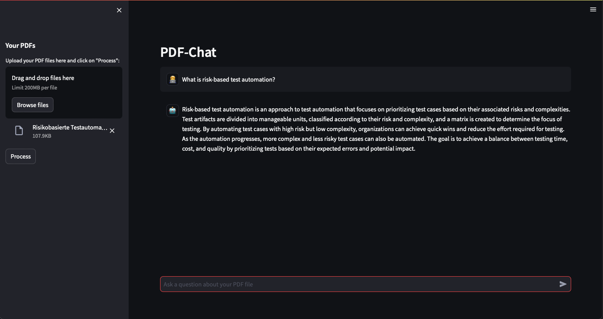
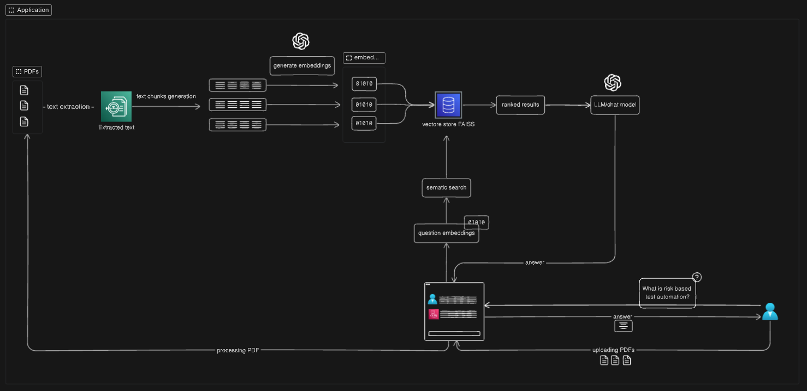

# PDF Chat App - An AI-driven Application

## Description

The PDF Chat App is a unique application that allows users to upload PDF files and chat with its content using a LLM like the GPT-3.5 Turbo model or higher. Built on the Streamlit framework, it enables an interactive web interface where users can seamlessly interact with the content of their PDFs. The underlying architecture leverages the power of FAISS as a vector store to make the interactions fast and relevant.

## Preview

  

## Architecture

  

## Features

- **PDF Upload**: Easily upload your PDFs and extract their content.
- **Interactive Chat**: Engage in a conversation with the content of your PDF using the GPT-3.5 Turbo model.
- **Efficient Retrieval**: With FAISS as the vector store, get quick and relevant responses.

## Frameworks & Libraries
- Streamlit: Used for creating the interactive web interface.
- FAISS: Enables efficient retrieval of chat responses.
- Langchain: A crucial framework for developing applications powered by language models.
- GPT-3.5 Turbo: The language model used for chat interactions.

## Installation & Setup

### **Clone the Repository**

- `git clone <repository-url>`

### **Navigate to the Directory**
- `cd path-to-repo`

### **Install the Dependencies**

Before running the app, ensure you have the necessary dependencies installed.

- `pip install -r requirements.txt`

### **Set up an .env file with your OPENAI API KEY**
- `OPENAI_API_KEY=XYZ`

### **Run the Streamlit App**

- `streamlit run pdf-chat-app.py`

## Usage

After successfully setting up the project:

1. Navigate to the Streamlit interface.
2. Upload your desired PDF file.
3. Engage in a chat with the content of the PDF.

## Feedback & Suggestions

While contributions aren't currently open, feedback and suggestions are always welcome. Please open an issue in the repository for any queries or suggestions.

   
